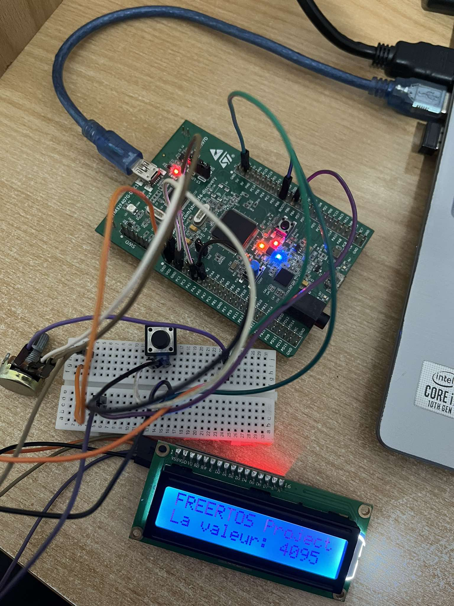
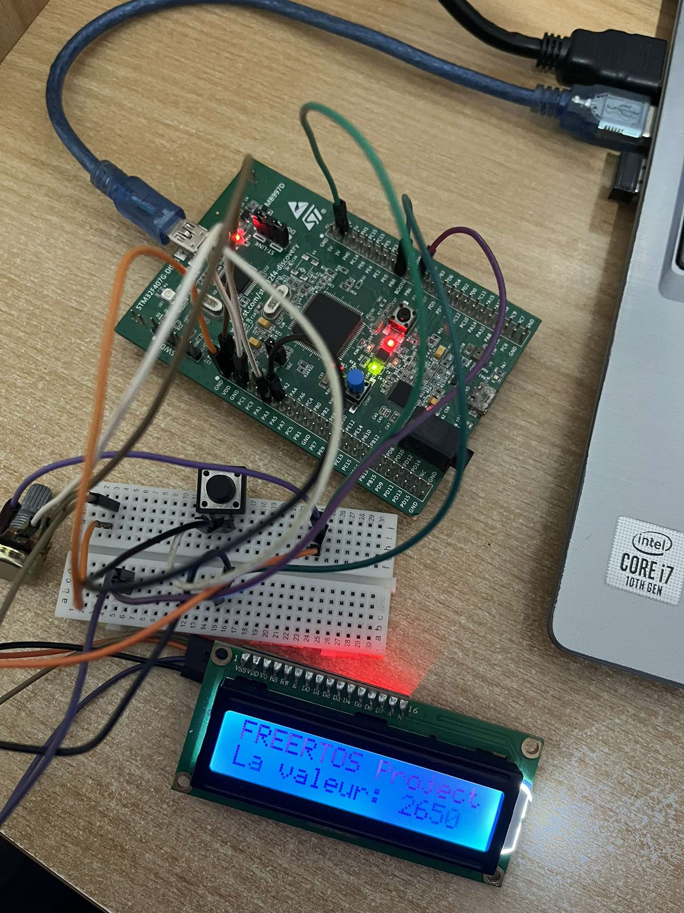
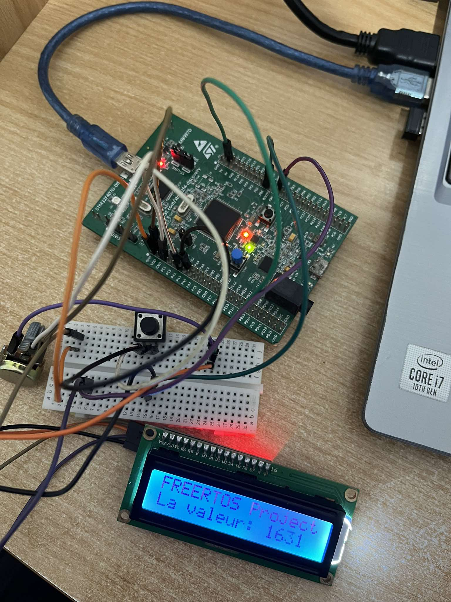
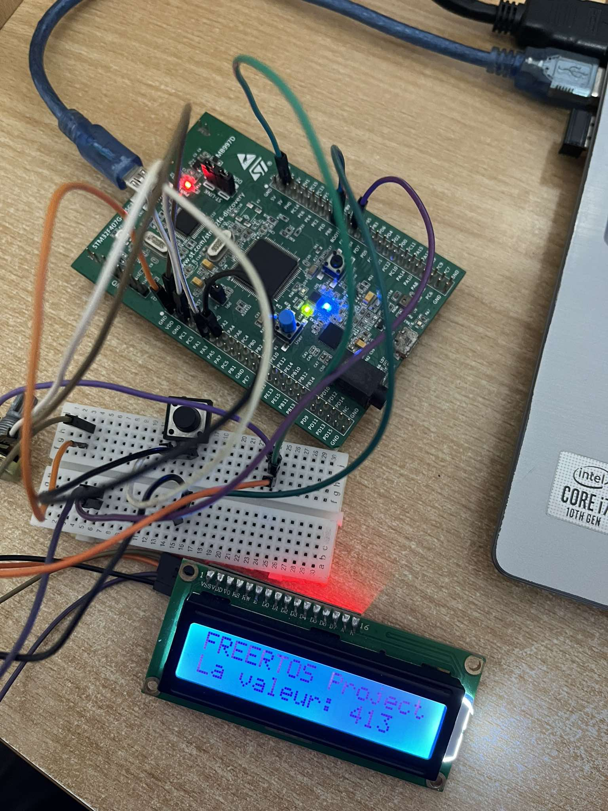

# FreeRTOS-Based Real-Time Embedded System on STM32
This project demonstrates how to use FreeRTOS on an STM32 microcontroller to create a real-time embedded system. The system reads data from sensors, manages LED indicators, and displays information on an LCD using multitasking and synchronization features provided by FreeRTOS.

This project was developed as part of a FreeRTOS workshop, where I learned the fundamentals of real-time operating systems and applied them to create a complete STM32-based application.
## What I learned
These are the key concepts to know about the fundamentals of real-time operating systems(RTOS): 

### 1. Difference Between Applications with an OS and Without an OS
- **Bare-Metal Systems:**
  - These systems operate without an operating system, meaning the application code directly interacts with the hardware.
  - Tasks are executed sequentially, which makes timing-critical applications difficult to manage as complexity grows.
  - **Example:** Polling-based systems or simple embedded systems with a single control loop.
- **With an OS:**
  Using an RTOS allows us to manage complexity while ensuring the system responds to real-time events. 
An RTOS excels at:
- Task prioritization: Ensuring that higher-priority tasks preempt lower-priority ones.
- Timing precision: Managing critical deadlines efficiently.

### 2. When to migrate from Bare Metal to Embedded OS: 
- **Bare Metal:** When the system is simple and timing requirements are predictable, such as controlling LEDs or managing a basic sensor.
- **Embedded OS (FreeRTOS):**
  - When the system is more complex and requires multitasking.
  - If tasks need to respond to events with strict timing constraints.
  - When inter-task communication and resource sharing are needed.

### 3. What is a Real-Time System?
it's any system designed to provide a **deterministic response** to specific events within a defined time frame (called deadline) 
  - **Hard Real-Time Systems:** Missing deadlines can lead to system failure (medical devices, aerospace systems).
  - **Soft Real-Time Systems:** Deadlines are flexible and occasional misses are tolerable (multimedia streaming).

### 4. What is FreeRTOS?
FreeRTOS is an open-source real-time operating system specifically designed for embedded systems. It provides:  
- A **lightweight kernel** capable of running on microcontrollers with limited resources.  
- Support for **multitasking**, enabling the execution of multiple tasks efficiently.  
- **APIs for synchronization** (semaphores, mutexes) and **communication** (queues).  
- High portability, supporting a wide range of microcontroller architectures.  
#### **CMSIS-RTOS Integration**
In this project, we used **CMSIS-RTOS**, which is a standard interface provided by ARM for integrating RTOS functionality with Cortex-M processors. CMSIS-RTOS acts as a wrapper around FreeRTOS, providing:  
- **Abstraction**: Simplifying RTOS API usage for developers.  
- **Portability**: Allowing easier migration between different RTOS implementations.  
- **Compatibility**: Integrating seamlessly with STM32CubeIDE for our project.
### 5. Core Concepts in FreeRTOS
#### Tasks
- Tasks are the smallest units of execution in FreeRTOS.
- **Task States:**
  - **Ready:** Task is ready to be executed but is not currently executing because a different task with equal or higher priority is running.
  - **Running:** Task is actually running( only one can be in this state at the moment).
  - **Blocked:** Task is waiting for a either a temporal or external event.
  - **Suspended:** Task is not available for scheduling, but still being kept in memory.
  - **Deleted:** Task is no longer part of the system.
#### Scheduler
It's an algorithm that decides which task based on priority( It selects a task of the list of Tasks that are READY) 
- FreeRTOS uses a **preemptive scheduler**, meaning higher-priority tasks can interrupt lower-priority ones.
- This ensures critical tasks are executed on time.
#### Queues 
 Queues are pipes that allow tasks to exchange data, they are used for **inter-task communication**
- The default queue is behaving as FIFO (First In-First Out) , we can also redefine it to perform as LIFO(Last In First Out)
- Within CMSIS-RTOS API there are two types of queues:
  -**Message**: where we can send only ineger type data or a pointer
  -**Mail**: where we can send memory blocks
- **Example:** Sending sensor data from a data acquisition task to a logging task.
#### Semaphores
-They are used to synchronize tasks with other events in the systems or to protect shared resources.
We can either: 

 -**Turn On** Semaphore: means to give a semaphore and can be done from another task or from an interrupt subroutine.
 
 -**Turn Off** Semaphore: means to Take the semaphore and can be done from the task.
 
-Types of Semaphores: 

 -**Binary** Simple on/off mechanism.
 -**Counting**: counts multiple give and multiple take.
 -**Mutex**-Mutual Exclusion type Semaphore:they include a **priority inheritance mechanism** to prevent priority inversion.
   - **Example:** Ensuring a single task accesses a shared memory region at a time.
     
## Helpful Resources
If you're new to FreeRTOS, I recommend checking out this excellent [YouTube series on FreeRTOS fundamentals](<https://www.youtube.com/playlist?list=PLEBQazB0HUyQ4hAPU1cJED6t3DU0h34bz>). It provides a clear and comprehensive introduction to the concepts I talked about.

## Implementation Details  
Below, you'll find the specific implementation of this project, demonstrating how the features and concepts explained above were realized using FreeRTOS and the STM32 platform.

## Project Overview

This project demonstrates the use of FreeRTOS on an STM32 microcontroller to design an embedded system with several tasks working together to manage data acquisition using ADC, LED control, and an LCD display via I2C. The objective is to showcase the usage of threads, message queues, semaphores, and mutexes in a real-time embedded system.

## System Architecture

-**Microcontroller**:**STM32F407VGT6**:
- **4 LEDs**: Connected to pins PD12, PD13, PD14, PD15 for indicating the system state.
- **Push button**: Connected to PA0 to simulate an external interrupt.
- **Analog sensor**: Connected to the ADC channel for data acquisition.
- **LCD**: Connected via I2C to display system data.
- **Emergency push button**: Connected to PA2 to trigger an urgent state.

## Task Breakdown

This system was designed to have 6 tasks running concurrently, with each task focusing on a specific functionality. The tasks are synchronized using FreeRTOS primitives like message queues, semaphores, and mutexes.

1. **Blue LED Task**: Toggles the blue LED every 500ms.
2. **Green LED Task**: Responds to the push button on PA0. It toggles the green LED and displays a message on the LCD on the first button press. It uses a semaphore to synchronize with the ADC task.
3. **Conversion Task**: Reads the potentiometer value using the ADC and sends the value to both the LED control task and the LCD task via message queues.
4. **LED Control Task**: Controls the orange and red LEDs based on the potentiometer value:
   - If value > 4000: Both LEDs on
   - If value > 2500: Orange LED off, Red LED on
   - If value > 1500: Orange LED on, Red LED off
   - If value < 1500: Both LEDs off
5. **LCD Task**: Displays the potentiometer value on the LCD. Uses a mutex to ensure exclusive access to the LCD for concurrent tasks.
6. **Emergency Task**: Detects a press of the PA2 button. When pressed, it displays "Urgence" on the LCD and holds the display until the button is released.

## Synchronization Primitives

To ensure proper synchronization and avoid race conditions, the following FreeRTOS primitives are used:

- **Message Queues:** Used to send data between tasks (ADC values for LED control and LCD display).
- **Semaphores:** Used to synchronize the tasks. For example, a semaphore is used to signal the Conversion Task when the Green LED Task toggles the green LED after a button press.
- **Mutexes:** Protect shared resources. The LCD Task uses a mutex to safely access the LCD in case of an emergency.

### Testing and Results

Here are some images showing the actual results of running the system:
#### When value>4000 

When value>2500

When value>1500

When value<1500

## Conclusion

This project serves as a practical demonstration of FreeRTOS on an STM32 microcontroller, highlighting how multitasking and synchronization primitives can be used to create an efficient, real-time embedded system.

I hope this project provides a helpful foundation for anyone looking to work with FreeRTOS and STM32 in embedded systems development. If you're interested in learning more, feel free to explore the provided resources or check out the official [FreeRTOS documentation](https://www.freertos.org/).

## License
This project is licensed under the MIT License.

